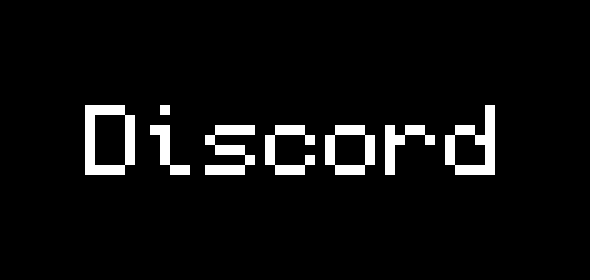

</a>

<h3 align="center">
What's It Like Trying to Recreate A Fantasy World in Minecraft?
</h3>

Keeping the experience mod free means we have to push minecraft to its limits, and we have the repositories here to show you how we did it.
Beyond the server, our backend infrastructure is built off Docker and Ansible. Both are powerful tools for the organization and automation
of software depoloyment respectively, and it allows us to streamline our development and simplify updates.

<h2 align="center">
Questions? Comments? Incident to Resolve?
</h2>

Join our discord link above to chat with us about the project or anything else, we'd love to have you.

